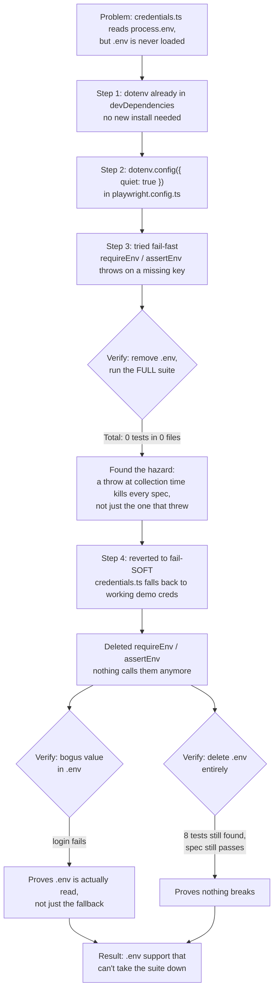

# Loading `.env` for the login credentials without breaking the suite

> Hand-drawn diagram version of this walkthrough: [`docs/env-detour-diagram.html`](../docs/env-detour-diagram.html) (published: [The .env Detour](https://claude.ai/code/artifact/d2aaa039-9991-4743-92e3-2d51cf70fc36))

**Problem:** `credentials.ts` read `STANDARD_USER`/`TTA_SECRET` from `process.env`, but nothing
ever loaded `.env` into `process.env` — `playwright.config.ts` imported `dotenv` but never
called `.config()`. The only way any spec got working credentials was exporting them in the
shell before every run.

## The steps, visually



**Approach:**

1. **Picked the library already present.** `dotenv@17.4.2` was in `devDependencies` and already
   imported (unused) at `playwright.config.ts:2`. No install needed.
2. **Put the load in `playwright.config.ts`, not a spec file.** `playwright.config.ts` is
   evaluated once, before any spec is collected — calling `dotenv.config({ quiet: true })`
   there guarantees every `process.env.*` read anywhere in the suite, including at module load
   time in `credentials.ts`, happens after `.env` is loaded. `quiet: true` silences dotenv v17's
   promotional tip banner, which otherwise prints once per worker process.
3. **Tried fail-fast first, then measured the blast radius before keeping it.** Added a
   `requireEnv`/`assertEnv` util that threw on a missing key, called at module scope in
   `e2e-checkout-env.spec.ts`. Looked correct in isolation. Then tested it against the rest of
   the suite instead of trusting it:
   ```bash
   mv .env .env.hidden && npx playwright test --list
   # Total: 0 tests in 0 files
   ```
   A throw at Playwright's *collection* phase kills the **entire run**, not just the file that
   threw — every unrelated spec (`login.spec.ts`, `e2e-checkout.spec.ts`) disappeared too. That
   is a real hazard for any repo where `.env` is gitignored: a fresh clone has no `.env` at all,
   so the whole suite would go from "8 tests" to "0 tests" with no clear signal why.
4. **Chose fail-*soft* over fail-fast plus a safety net.** Rather than keep the throw and add a
   CI step to seed `.env`, `credentials.ts` was changed to a working fallback:
   ```ts
   standardUser: process.env.STANDARD_USER || 'standard_user',
   password: process.env.TTA_SECRET || 'tta_secret',
   ```
   `||`, not `??`, so an empty string also falls through. A missing or partial `.env` is now a
   non-event: the suite runs on sensible defaults, and `.env` simply overrides them when present.
   The `requireEnv`/`assertEnv` util was deleted — nothing calls it anymore.
5. **Proved precedence instead of trusting it.** Kept dotenv's `override: false` default, then
   ran two checks: set `STANDARD_USER=env_proof_user` in `.env` (a bogus account) and confirmed
   login now *fails* — proving `.env` is actually read, not just the fallback; then deleted
   `.env` entirely and confirmed `npx playwright test --list` still finds all 8 tests and
   `e2e-checkout-env.spec.ts` still passes via the fallback. A spec that reads `.env` and one
   that ignores it look identical when the file happens to hold the same values as the fallback
   — only forcing a mismatch (or removing the file) actually distinguishes them.

**Judgment calls:**

- Did NOT wire the existing `USERNAME=admin` / `PASSWORD=ADMIN123` keys already sitting in
  `.env`. They are not valid TTACart accounts — using them would produce a green-looking change
  that fails at login.
- Did NOT keep a separate `src/utils/env.ts` util once fail-fast was dropped. A `requireEnv`
  with no callers left is just unused surface area; simpler to delete it than keep it "for
  later."
- Did NOT route checkout guest details (first name, postal code) or the item ID through `.env`.
  Env vars are for secrets/config, not test fixture data — this project already has the right
  pattern for that (`testdata/logintestdata.json` + `DataGenerator`/Faker), and mixing the two
  wasn't the actual ask.
- Did commit a `.env.example` documenting every var the project reads. It stopped being
  load-bearing once the fail-fast throw was removed, but it's still the only place a fresh
  clone (which never sees the gitignored `.env`) can learn what variables exist.

**Reusable rule:** Load `dotenv` once, in the framework's config file, never inline in a spec —
config files are evaluated before spec collection, so there's no import-order race to worry
about. And before adding a load-time throw anywhere, run the full suite with the config file it
depends on removed: a collection-time failure can take down every spec, not just the one that
threw, and a gitignored `.env` means that scenario isn't hypothetical — it's what every fresh
clone actually looks like.
